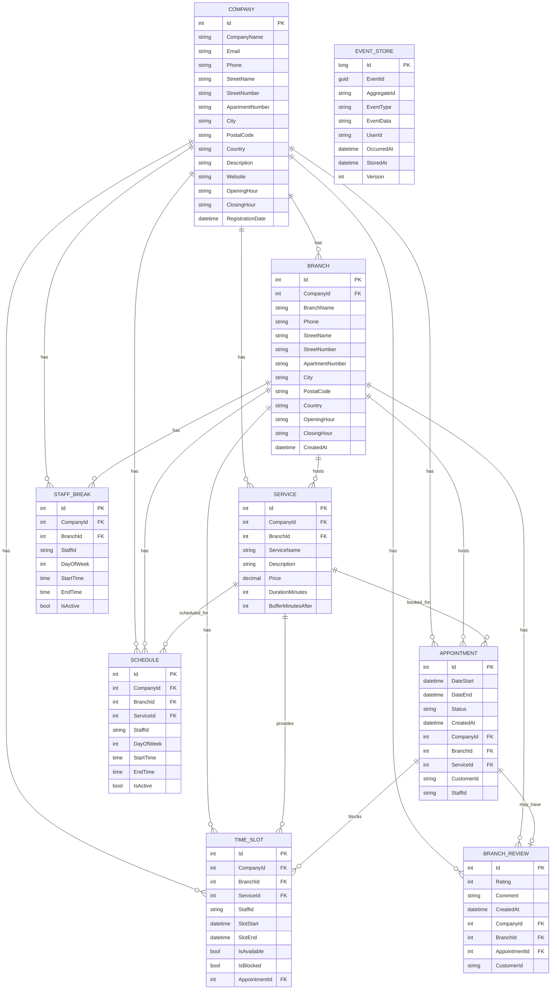
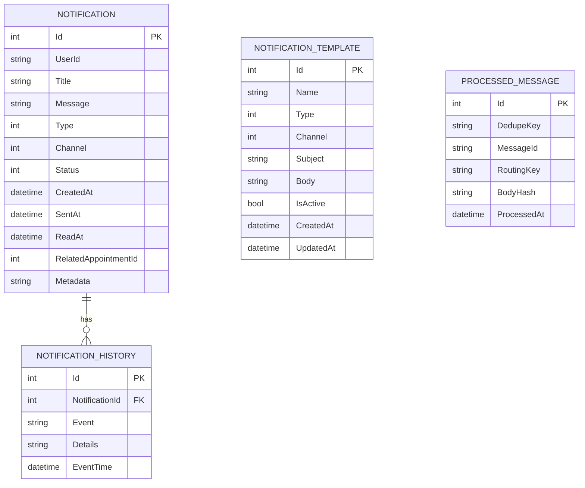
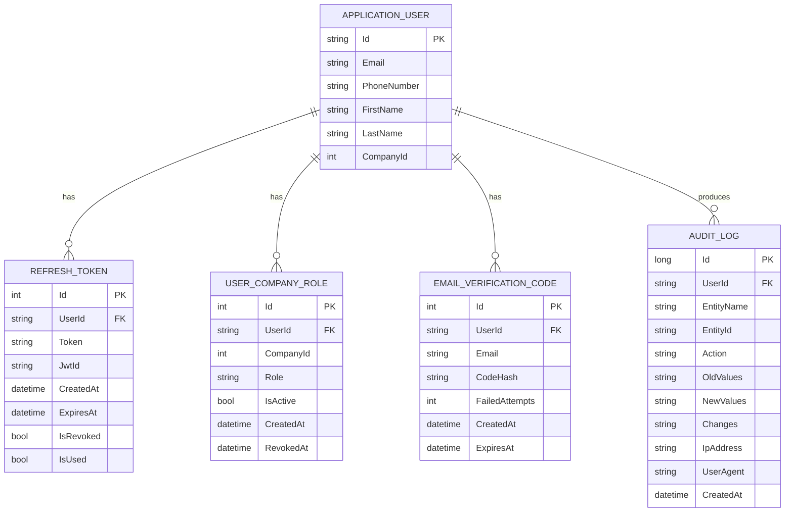
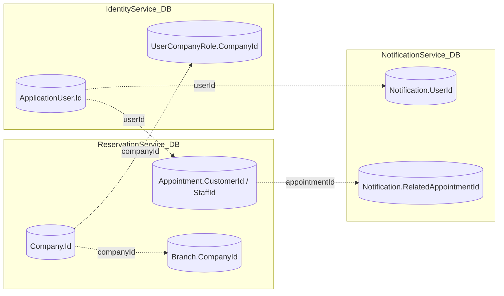

# System do Zarządzania Rezerwacjami i Zasobami dla Małych Firm (Mikro SaaS)

## Stack

- **Backend:** C# .NET 8, ASP.NET Core, Entity Framework Core
- **Frontend:** React, Vite, Axios
- **Bazy danych:** PostgreSQL (3 osobne bazy)
- **Messaging:** RabbitMQ
- **Konteneryzacja:** Docker, Docker Compose
- **Autentykacja:** JWT (Access + Refresh Tokens)

## Komponenty Systemu

| Serwis                        | Port  | Opis                        | Funkcjonalności                                           |
| ----------------------------- | ----- | --------------------------- | ---------------------------------------------------------- |
| **IdentityService**     | 5001  | Autentykacja i użytkownicy | JWT, Refresh Tokens, Audit Logs, Role użytkowników       |
| **ReservationService**  | 5002  | Rezerwacje i usługi        | Firmy, Usługi, Rezerwacje, Harmonogramy, Time Sloty       |
| **NotificationService** | 5003  | Powiadomienia               | Email, SMS, In-App, SignalR Hub, Szablony                  |
| **API Gateway**         | 5000  | Gateway (Ocelot)            | Centralne wejście, routing, rate limiting, JWT validation |
| **RabbitMQ**            | 15672 | Message Broker              | Management UI (15672) + AMQP (5672), asynchroniczna komunikacja |
| **PostgreSQL**          | 5433  | Bazy danych                 | identitydb, reservationdb, notificationdb                  |

## Diagramy (Mermaid)

### InterService Communication (Flow)

```mermaid
flowchart LR
  FE[Frontend<br/>React]
  GW[API Gateway<br/>:5000]
  ID[Identity Service<br/>:5001]
  RS[Reservation Service<br/>:5002]
  NS[Notification Service<br/>:5003]
  MQ[(RabbitMQ<br/>AMQP :5672)]
  HUB[[SignalR Hub<br/>/notification/hub]]

  %% REST
  FE -->|REST (HTTP)| GW
  GW -->|REST (HTTP)| FE
  GW -->|REST| ID
  GW -->|REST| RS
  GW -->|REST| NS

  %% Events
  RS -->|publish appointment.* events| MQ
  MQ -->|consume events| NS

  %% SignalR (WebSocket)
  FE -->|SignalR WebSocket<br/>ws(s) /notification/hub| GW
  GW -->|SignalR WebSocket| FE
  GW -->|WS proxy pass-through| HUB
  HUB -->|WS| GW
  HUB --- NS
```

### ERD (ReservationService DB)



Uwagi do ERD (ReservationService):

- **CustomerId/StaffId** to identyfikatory użytkowników z IdentityService.
- **AppointmentId** w `BranchReview` jest unikalny (jeden review na wizytę).
- **AppointmentId** w `TimeSlot` jest opcjonalny (slot może być wolny).

### ERD (NotificationService DB)



Uwagi do ERD (NotificationService):

- `UserId` może być GUID z IdentityService; historycznie mogło też przyjmować email/telefon.
- `RelatedAppointmentId` wskazuje na `Appointment.Id` z ReservationService (powiązanie logiczne między bazami).
- `DedupeKey` w `ProcessedMessage` jest unikalny (idempotencja konsumenta RabbitMQ).

### ERD (IdentityService DB - uproszczone)



Uwagi do ERD (IdentityService):

- `CompanyId` w `ApplicationUser` jest opcjonalny.
- `Token` w `RefreshToken` jest unikalny.
- `UserId` w `AuditLog` jest opcjonalny (np. akcje systemowe).

### Widok logiczny między serwisami (cross-service)



## Zaimplementowane Funkcjonalności

### Bezpieczeństwo

- **JWT Authentication** - Access Token (15 min) + Refresh Token (7 dni)
- **Auto-refresh tokenów** - Automatyczne odświeżanie w frontendzie
- **Protected Routes** - Chronione ścieżki w React
- **Audit Logs** - Śledzenie wszystkich operacji użytkowników
- **User Company Roles** - Role użytkowników per firma (multi-tenancy)

### Zarządzanie Rezerwacjami

- **Schedules** - Harmonogramy per firma/usługa/pracownik
- **Time Slots** - Dynamiczne generowanie dostępnych terminów
- **Appointment Booking** - Pełny flow rezerwacji
- **Event Sourcing** - Historia wszystkich zmian w rezerwacjach
- **Soft Delete** - Bezpieczne usuwanie danych

### Powiadomienia

- **Multi-channel** - Email, SMS, In-App
- **SignalR Hub** - Real-time powiadomienia
- **Templates** - Szablony powiadomień
- **History** - Historia wysłanych powiadomień

### API Gateway (Ocelot)

- **Centralne wejście** - Jeden punkt dostępu do wszystkich mikroserwisów
- **Routing** - Automatyczne przekierowanie do odpowiednich serwisów
- **Rate Limiting** - Ochrona przed przeciążeniem (100 req/min)
- **JWT Validation** - Weryfikacja tokenów na poziomie gateway
- **Circuit Breaker** - Automatyczna obsługa błędów z Polly
- **Load Balancing** - Round-robin dla wielu instancji
- **CORS** - Centralna konfiguracja CORS

## Quick Start

### Linux/Mac

```bash
# Uruchom cały system (backend + frontend)
./manage.sh all

# Lub
./manage.sh start      # Uruchom backend
./manage.sh frontend   # Uruchom frontend (w nowym terminalu)
```

### Windows

```batch
# Uruchom cały system (backend + frontend)
manage.bat all

# Lub
manage.bat start      # Uruchom backend
manage.bat frontend   # Uruchom frontend (w nowym oknie)
```

## Komendy

| Komenda  | Linux/Mac                | Windows                 | Opis                     |
| -------- | ------------------------ | ----------------------- | ------------------------ |
| Pomoc    | `./manage.sh help`     | `manage.bat help`     | Pokaż wszystkie komendy |
| Start    | `./manage.sh start`    | `manage.bat start`    | Uruchom backend          |
| Stop     | `./manage.sh stop`     | `manage.bat stop`     | Zatrzymaj backend        |
| Restart  | `./manage.sh restart`  | `manage.bat restart`  | Restart z czyszczeniem   |
| Status   | `./manage.sh status`   | `manage.bat status`   | Sprawdź status          |
| Test     | `./manage.sh test`     | `manage.bat test`     | Testuj endpointy         |
| CI Test  | `./manage.sh ci-test`  | `manage.bat ci-test`  | Test CI/CD lokalnie      |
| Logi     | `./manage.sh logs`     | `manage.bat logs`     | Pokaż logi              |
| Frontend | `./manage.sh frontend` | `manage.bat frontend` | Uruchom React            |
| All      | `./manage.sh all`      | `manage.bat all`      | Backend + Frontend       |

## Adresy

- **Aplikacja:** http://localhost:5173
- **API Gateway:** http://localhost:5000 (główny punkt wejścia)
- **Identity API:** http://localhost:5001/swagger
- **Reservation API:** http://localhost:5002/swagger
- **Notification API:** http://localhost:5003/swagger
- **RabbitMQ Management:** http://localhost:15672 (guest/guest)
- **PostgreSQL:** localhost:5433

## API Gateway Routing

Wszystkie requesty przechodzą przez API Gateway (port 5000):

| Ścieżka Gateway   | Przekierowanie do        | Opis                       |
| ------------------- | ------------------------ | -------------------------- |
| `/identity/*`     | IdentityService:5001     | Autentykacja, użytkownicy |
| `/reservation/*`  | ReservationService:5002  | Rezerwacje, usługi        |
| `/notification/*` | NotificationService:5003 | Powiadomienia              |

### Przykłady:

```bash
# Zamiast: http://localhost:5001/api/account/login
# Używany:  http://localhost:5000/identity/account/login

# Zamiast: http://localhost:5002/api/services
# Używany:  http://localhost:5000/reservation/services
```

## JWT Authentication Endpoints

### Podstawowe

W praktyce frontend woła endpointy przez **API Gateway** (`http://localhost:5000`).

- `POST /identity/account/register` - Rejestracja nowego użytkownika
- `POST /identity/account/login` - Logowanie (zwraca access + refresh token)
- `POST /identity/account/logout` - Wylogowanie

### Token Management

- `POST /identity/refreshtoken/refresh` - Odśwież access token
- `POST /identity/refreshtoken/revoke` - Unieważnij token
- `POST /identity/refreshtoken/revoke-all` - Unieważnij wszystkie tokeny użytkownika

### Audit

- `GET /identity/audit` - Lista wszystkich logów
- `GET /identity/audit/my` - Logi zalogowanego użytkownika
- `GET /identity/audit/user/{id}` - Logi konkretnego użytkownika

### Schedules

- `GET /reservation/schedules/company/{id}` - Harmonogramy firmy
- `GET /reservation/schedules/available-slots` - Dostępne sloty czasowe
- `POST /reservation/schedules` - Utwórz harmonogram
- `POST /reservation/schedules/book-slot` - Zarezerwuj slot

### Appointments (Reservation)

- `PUT /reservation/appointments/{id}/reschedule` - Przełóż wizytę
- `DELETE /reservation/appointments/{id}` - Usuń wizytę (emituje `appointment.cancelled` przed usunięciem)

### Notifications (Notification)

- `GET /notification/notifications/me` - Lista moich powiadomień
- `PUT /notification/notifications/{id}/read` - Oznacz jako przeczytane
- `GET /notification/hub` - SignalR Hub (WebSocket)

## Dane Testowe

Automatycznie tworzony użytkownik testowy:

- **Email:** test@example.com
- **Hasło:** Test123!

## Wymagania haseł

- Minimum **6 znaków**
- Musi zawierać **1 cyfrę**