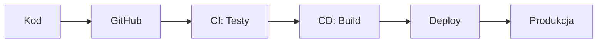

# CI/CD Pipeline - Instrukcja konfiguracji

## Spis treści

1. [Co to jest CI/CD?](#co-to-jest-cicd)
2. [Dlaczego warto używać?](#dlaczego-warto-używać)
3. [Konfiguracja GitHub Actions](#konfiguracja-github-actions)
4. [Konfiguracja serwera](#konfiguracja-serwera)
5. [Pierwsze wdrożenie](#pierwsze-wdrożenie)
6. [Monitorowanie](#monitorowanie)

## Co to jest CI/CD?

**CI/CD** to zautomatyzowany proces budowania, testowania i wdrażania aplikacji:



### Continuous Integration (CI)

- Automatyczne testowanie przy każdym `git push`
- Sprawdzanie jakości kodu
- Budowanie aplikacji
- Wykrywanie błędów na wczesnym etapie

### Continuous Deployment (CD)

- Automatyczne wdrażanie na serwer
- Zero-downtime deployments
- Rollback w razie problemów
- Różne środowiska (dev, staging, prod)

## Dlaczego warto używać?

| Bez CI/CD                   | Z CI/CD                                 |
| --------------------------- | --------------------------------------- |
| Ręczne testowanie (30 min) | Automatyczne testy (3 min)              |
| Ręczny deployment (1h)     | Auto-deploy (5 min)                     |
| Błędy wykrywane późno   | Błędy wykrywane natychmiast           |
| Ryzyko podczas wdrożeń    | Bezpieczne, testowane wdrożenia        |
| Brak historii deploymentów | Pełna historia i możliwość rollback |

## Konfiguracja GitHub Actions

### Krok 1: Secrets w GitHub

Przejdź do: `Settings → Secrets and variables → Actions`

Dodaj następujące secrets:

```yaml
# Wymagane
SSH_PRIVATE_KEY        # Klucz SSH do serwera
SERVER_HOST           # IP lub domena serwera
SERVER_USER           # Użytkownik SSH

# Opcjonalne
SLACK_WEBHOOK         # Powiadomienia Slack
DOCKER_HUB_USERNAME   # Jeśli używasz Docker Hub
DOCKER_HUB_TOKEN      # Token Docker Hub
```

### Krok 2: Environments

Przejdź do: `Settings → Environments`

Utwórz środowiska:

- **staging** - dla brancha `develop`
- **production** - dla brancha `main`

Dla produkcji włącz:

- Required reviewers (wymaga zatwierdzenia)
- Deployment protection rules

### Krok 3: GitHub Container Registry

1. Wygeneruj Personal Access Token:

   - Settings → Developer settings → Personal access tokens
   - Scopes: `write:packages`, `delete:packages`, `repo`
2. Zaloguj się lokalnie:

```bash
echo $PAT | docker login ghcr.io -u USERNAME --password-stdin
```

## Konfiguracja serwera

### Wymagania serwera

- **System**: Ubuntu 20.04+ / Debian 11+
- **RAM**: Minimum 4GB (zalecane 8GB)
- **CPU**: 2 vCPU (zalecane 4 vCPU)
- **Dysk**: 50GB SSD
- **Docker**: 20.10+
- **Docker Compose**: 2.0+

### Instalacja na serwerze

```bash
# 1. Aktualizacja systemu
sudo apt update && sudo apt upgrade -y

# 2. Instalacja Docker
curl -fsSL https://get.docker.com -o get-docker.sh
sudo sh get-docker.sh
sudo usermod -aG docker $USER

# 3. Instalacja Docker Compose
sudo curl -L "https://github.com/docker/compose/releases/latest/download/docker-compose-$(uname -s)-$(uname -m)" -o /usr/local/bin/docker-compose
sudo chmod +x /usr/local/bin/docker-compose

# 4. Utworzenie struktury katalogów
sudo mkdir -p /opt/mikrosaas/{logs,backups,ssl}
sudo chown -R $USER:$USER /opt/mikrosaas

# 5. Konfiguracja firewall
sudo ufw allow 22/tcp    # SSH
sudo ufw allow 80/tcp    # HTTP
sudo ufw allow 443/tcp   # HTTPS
sudo ufw enable
```

### Konfiguracja SSH dla CI/CD

```bash
# Na serwerze - generowanie klucza dla deploymentów
ssh-keygen -t ed25519 -C "github-actions" -f ~/.ssh/github_actions

# Dodaj klucz publiczny do authorized_keys
cat ~/.ssh/github_actions.pub >> ~/.ssh/authorized_keys

# Skopiuj klucz PRYWATNY i dodaj jako GitHub Secret (SSH_PRIVATE_KEY)
cat ~/.ssh/github_actions
```

## Pierwsze wdrożenie

### 1. Przygotowanie środowiska produkcyjnego

```bash
# Na serwerze
cd /opt/mikrosaas

# Skopiuj pliki konfiguracyjne
wget https://raw.githubusercontent.com/yourusername/yourrepo/main/app/backend/docker-compose.prod.yml

# Utwórz plik .env
cp .env.production.example .env
nano .env  # Uzupełnij wszystkie wartości
```

### 2. Certyfikaty SSL (Let's Encrypt)

```bash
# Instalacja certbot
sudo apt install certbot

# Wygenerowanie certyfikatu
sudo certbot certonly --standalone -d your-domain.com -d api.your-domain.com

# Konwersja na format PFX dla .NET
sudo openssl pkcs12 -export \
  -out /opt/mikrosaas/ssl/cert.pfx \
  -inkey /etc/letsencrypt/live/your-domain.com/privkey.pem \
  -in /etc/letsencrypt/live/your-domain.com/fullchain.pem \
  -password pass:your_password
```

### 3. Pierwsze uruchomienie

```bash
# Pull obrazów
docker-compose -f docker-compose.prod.yml pull

# Uruchomienie
docker-compose -f docker-compose.prod.yml up -d

# Sprawdzenie statusu
docker-compose -f docker-compose.prod.yml ps

# Logi
docker-compose -f docker-compose.prod.yml logs -f
```

### 4. Push kodu i automatyczny deploy

```bash
# Lokalnie
git add .
git commit -m "feat: Configure CI/CD pipeline"
git push origin main

# GitHub Actions automatycznie:
# 1. Uruchomi testy
# 2. Zbuduje obrazy Docker
# 3. Wypushuje do GitHub Container Registry
# 4. Deployuje na serwer
```

## Monitorowanie

### Sprawdzanie statusu

```bash
# Status kontenerów
docker ps

# Użycie zasobów
docker stats

# Logi aplikacji
docker logs mikrosaas-api-gateway -f

# Healthcheck
curl https://your-domain.com/health
```

### Grafana Dashboard

1. Otwórz: `http://your-server:3000`
2. Login: `admin` / `[hasło z .env]`
3. Importuj dashboard: `13489` (Docker monitoring)

### Alerty

Skonfiguruj alerty w Grafana:

- CPU > 80%
- RAM > 80%
- Dysk > 90%
- Serwis down > 1 min

## Troubleshooting

### Problem: Deploy failed - connection refused

```bash
# Sprawdź czy Docker działa
sudo systemctl status docker

# Restart Docker
sudo systemctl restart docker
```

### Problem: Out of disk space

```bash
# Wyczyść niewykorzystane obrazy
docker system prune -a -f

# Sprawdź logi
du -h /opt/mikrosaas/logs

# Rotacja logów
find /opt/mikrosaas/logs -name "*.log" -mtime +7 -delete
```

### Problem: Service unhealthy

```bash
# Restart konkretnego serwisu
docker-compose -f docker-compose.prod.yml restart identity_api

# Sprawdź logi
docker logs mikrosaas-identity --tail 100
```

## Best Practices

### 1. Branching Strategy

```
main        → Produkcja (auto-deploy)
develop     → Staging (auto-deploy)
feature/*   → Development (tylko testy)
hotfix/*    → Szybkie poprawki (deploy do prod)
```

### 2. Semantic Versioning

```bash
# Tagowanie release
git tag -a v1.0.0 -m "First production release"
git push origin v1.0.0
```

### 3. Backup Strategy

```bash
# Automatyczny backup (cron)
0 2 * * * /opt/mikrosaas/scripts/backup.sh

# Backup ręczny
docker exec mikrosaas-postgres pg_dump -U mikrosaas_user identitydb > backup_$(date +%Y%m%d).sql
```

### 4. Security Checklist

- [ ] Zmienione wszystkie domyślne hasła
- [ ] SSL/TLS skonfigurowany
- [ ] Firewall skonfigurowany
- [ ] Secrets w GitHub, nie w kodzie
- [ ] Regularne aktualizacje Docker images
- [ ] Monitoring i alerty włączone
- [ ] Backup skonfigurowany
- [ ] Rate limiting włączony

## Komendy pomocnicze

```bash
# Rollback do poprzedniej wersji
docker-compose -f docker-compose.prod.yml down
docker-compose -f docker-compose.prod.yml pull
docker-compose -f docker-compose.prod.yml up -d

# Skalowanie serwisu
docker-compose -f docker-compose.prod.yml up -d --scale identity_api=3

# Wykonanie migracji bazy
docker exec -it mikrosaas-identity dotnet ef database update

# Export logów
docker logs mikrosaas-api-gateway > gateway_$(date +%Y%m%d).log

# Health check wszystkich serwisów
for service in api-gateway identity reservation notification; do
  echo "Checking $service..."
  curl -f http://localhost:5000/$service/health || echo "FAILED"
done
```

## Kontakt i wsparcie

- Email: your-email@example.com
- Slack: #devops-channel
- Wiki: https://github.com/yourusername/yourrepo/wiki

---

**Gotowe!** Twój CI/CD pipeline jest skonfigurowany i gotowy do użycia! 🚀
