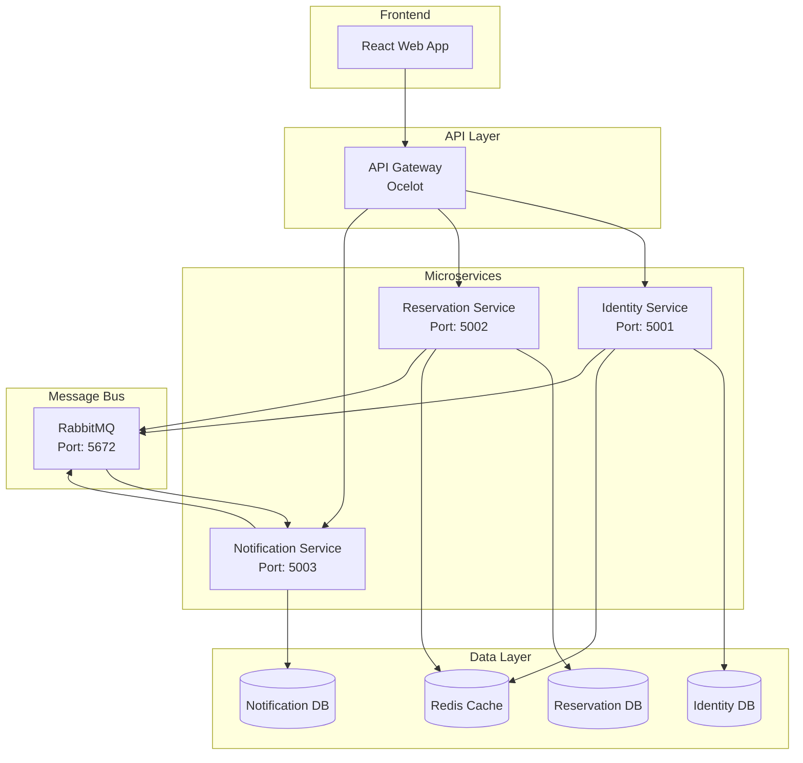
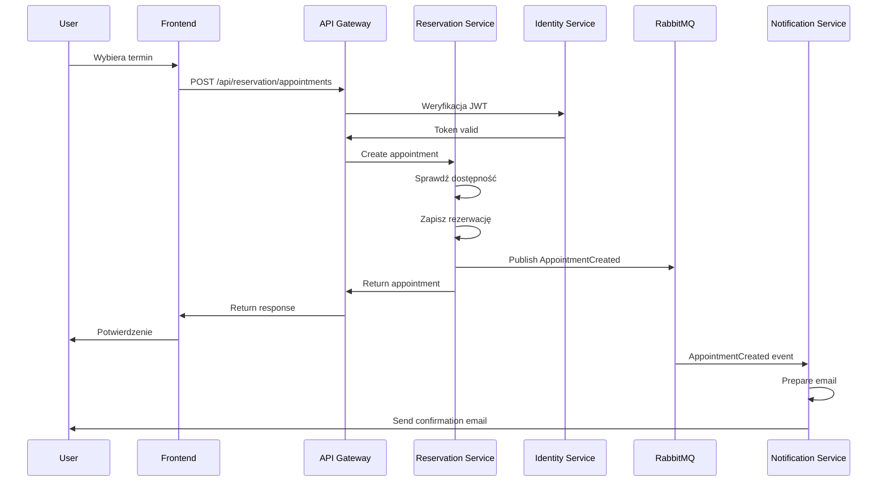

# 🏗️ Architektura Systemu Rezerwacji - Mikroserwisy

## 📋 Przegląd Architektury

System jest zbudowany w oparciu o architekturę mikroserwisów z następującymi komponentami:



---

## 🎯 Mikroserwisy

### **1. Identity Service (Port 5001)**

**Odpowiedzialności:**
- Autentykacja użytkowników (login/register)
- Autoryzacja (role i uprawnienia)
- Zarządzanie tokenami JWT
- Zarządzanie profilami użytkowników
- Password reset i account recovery

**Technologie:**
- ASP.NET Core 8
- Entity Framework Core
- JWT Bearer Authentication
- BCrypt.Net dla haszowania haseł

**Endpointy API:**
```
POST   /api/auth/register
POST   /api/auth/login
POST   /api/auth/refresh
POST   /api/auth/logout
POST   /api/auth/forgot-password
POST   /api/auth/reset-password
GET    /api/users/profile
PUT    /api/users/profile
GET    /api/users/{id}
```

**Eventy publikowane:**
- `UserRegistered`
- `UserLoggedIn`
- `UserProfileUpdated`
- `PasswordChanged`

---

### **2. Reservation Service (Port 5002)**

**Odpowiedzialności:**
- Zarządzanie firmami
- Zarządzanie usługami
- Zarządzanie pracownikami
- Obsługa rezerwacji
- Zarządzanie harmonogramami
- Sprawdzanie dostępności

**Technologie:**
- ASP.NET Core 8
- Entity Framework Core
- Dapper (dla skomplikowanych zapytań)
- FluentValidation

**Endpointy API:**
```
# Companies
GET    /api/companies
GET    /api/companies/{id}
POST   /api/companies
PUT    /api/companies/{id}
DELETE /api/companies/{id}

# Services
GET    /api/companies/{companyId}/services
GET    /api/services/{id}
POST   /api/services
PUT    /api/services/{id}
DELETE /api/services/{id}

# Staff
GET    /api/companies/{companyId}/staff
GET    /api/staff/{id}
POST   /api/staff
PUT    /api/staff/{id}

# Schedules
GET    /api/staff/{staffId}/schedule
POST   /api/staff/{staffId}/schedule
PUT    /api/schedules/{id}

# Appointments
GET    /api/appointments
GET    /api/appointments/{id}
POST   /api/appointments
PUT    /api/appointments/{id}/confirm
PUT    /api/appointments/{id}/cancel
GET    /api/appointments/availability

# Slots
GET    /api/slots/available
```

**Eventy publikowane:**
- `AppointmentCreated`
- `AppointmentConfirmed`
- `AppointmentCancelled`
- `AppointmentCompleted`
- `ServiceCreated`
- `ServiceUpdated`

---

### **3. Notification Service (Port 5003)**

**Odpowiedzialności:**
- Wysyłanie emaili
- Wysyłanie SMS (opcjonalnie)
- Zarządzanie szablonami powiadomień
- Kolejkowanie powiadomień
- Ponawianie nieudanych wysyłek

**Technologie:**
- ASP.NET Core 8
- Hangfire (background jobs)
- SendGrid (email)
- Twilio (SMS - opcjonalnie)

**Endpointy API:**
```
GET    /api/notifications/templates
POST   /api/notifications/send
GET    /api/notifications/history
GET    /api/notifications/queue
```

**Eventy konsumowane:**
- `AppointmentCreated` → Wysyła potwierdzenie
- `AppointmentConfirmed` → Wysyła potwierdzenie
- `AppointmentCancelled` → Wysyła informację o anulowaniu
- `UserRegistered` → Wysyła email powitalny

---

## 🚪 API Gateway (Ocelot) - Port 5000

**Funkcje:**
- Routing do mikroserwisów
- Load balancing
- Rate limiting
- Autoryzacja na poziomie gateway
- Request/Response transformation
- Caching

**Konfiguracja routingu:**
```json
{
  "Routes": [
    {
      "DownstreamPathTemplate": "/api/{everything}",
      "DownstreamScheme": "http",
      "DownstreamHostAndPorts": [
        {
          "Host": "identity-api",
          "Port": 5001
        }
      ],
      "UpstreamPathTemplate": "/api/identity/{everything}",
      "UpstreamHttpMethod": [ "GET", "POST", "PUT", "DELETE" ]
    },
    {
      "DownstreamPathTemplate": "/api/{everything}",
      "DownstreamScheme": "http",
      "DownstreamHostAndPorts": [
        {
          "Host": "reservation-api",
          "Port": 5002
        }
      ],
      "UpstreamPathTemplate": "/api/reservation/{everything}",
      "UpstreamHttpMethod": [ "GET", "POST", "PUT", "DELETE" ],
      "AuthenticationOptions": {
        "AuthenticationProviderKey": "Bearer"
      }
    }
  ]
}
```

---

## 📨 Message Bus (RabbitMQ)

### **Exchanges:**
- `reservation.events` - Topic exchange dla eventów domenowych

### **Queues:**
- `notification.appointment-events` - Dla Notification Service
- `audit.all-events` - Dla audytu (opcjonalne)

### **Routing Keys:**
- `appointment.created`
- `appointment.confirmed`
- `appointment.cancelled`
- `user.registered`

---

## 🗄️ Bazy Danych

### **Strategia:**
- Każdy mikroserwis ma własną bazę danych (Database per Service)
- Można użyć jednej instancji PostgreSQL z różnymi schematami
- Lub osobne instancje dla pełnej izolacji

### **Schematy:**
1. **identity_db** - dla Identity Service
2. **reservation_db** - dla Reservation Service  
3. **notification_db** - dla Notification Service

---

## 🔄 Wzorce Komunikacji

### **1. Synchroniczna (REST)**
- Frontend → API Gateway → Microservices
- Używana dla operacji wymagających natychmiastowej odpowiedzi

### **2. Asynchroniczna (Events)**
- Microservice → RabbitMQ → Other Microservices
- Używana dla operacji długotrwałych i loose coupling

### **3. CQRS Pattern**
- Commands: Modyfikują stan (POST, PUT, DELETE)
- Queries: Odczytują stan (GET)
- Opcjonalnie: Osobne modele dla odczytu i zapisu

---

## 🛡️ Bezpieczeństwo

### **Authentication & Authorization:**
1. JWT tokens wydawane przez Identity Service
2. API Gateway weryfikuje tokeny
3. Role-based access control (RBAC)
4. Refresh tokens dla długotrwałych sesji

### **Zabezpieczenia:**
- HTTPS everywhere (w produkcji)
- Rate limiting na API Gateway
- CORS skonfigurowane poprawnie
- Secrets w zmiennych środowiskowych
- SQL Injection protection (parametrized queries)
- XSS protection (sanitizacja inputów)

---

## 🚀 Deployment

### **Development:**
```bash
docker-compose up
```

### **Production:**
```bash
docker-compose -f docker-compose.yml -f docker-compose.prod.yml up -d
```

### **Kubernetes (opcjonalnie):**
- Deployment dla każdego mikroserwisu
- Service dla exposowania portów
- Ingress dla routingu
- ConfigMaps dla konfiguracji
- Secrets dla wrażliwych danych

---

## 📊 Monitoring i Logging

### **Logging:**
- Serilog we wszystkich serwisach
- Strukturowane logi do Seq
- Correlation ID dla śledzenia requestów

### **Monitoring:**
- Health checks dla każdego serwisu
- Prometheus metrics (opcjonalnie)
- Grafana dashboards (opcjonalnie)

### **Distributed Tracing:**
- OpenTelemetry (opcjonalnie)
- Jaeger dla wizualizacji (opcjonalnie)

---

## 🔧 Narzędzia Deweloperskie

### **Wymagane:**
- .NET 8 SDK
- Node.js 18+
- Docker Desktop
- Visual Studio 2022 / VS Code / Rider

### **Opcjonalne:**
- Postman/Insomnia dla testowania API
- pgAdmin dla zarządzania PostgreSQL
- RabbitMQ Management UI
- Seq dla przeglądania logów

---

## 📈 Skalowanie

### **Horizontal Scaling:**
- Każdy mikroserwis może być skalowany niezależnie
- Load balancing przez API Gateway
- Stateless services (stan w bazie/cache)

### **Caching Strategy:**
- Redis dla cache'owania często używanych danych
- Response caching na API Gateway
- ETag support dla conditional requests

---

## 🎯 Best Practices

1. **Domain-Driven Design (DDD)**
   - Bounded Contexts dla każdego serwisu
   - Aggregate Roots
   - Value Objects

2. **Clean Architecture**
   - Separation of Concerns
   - Dependency Inversion
   - SOLID principles

3. **12-Factor App**
   - Config w środowisku
   - Stateless processes
   - Dev/prod parity

4. **API Versioning**
   - URL versioning (/api/v1/)
   - Header versioning (opcjonalnie)

5. **Error Handling**
   - Global exception handlers
   - Consistent error responses
   - Proper HTTP status codes

---

## 📝 Przykład Flow Rezerwacji


